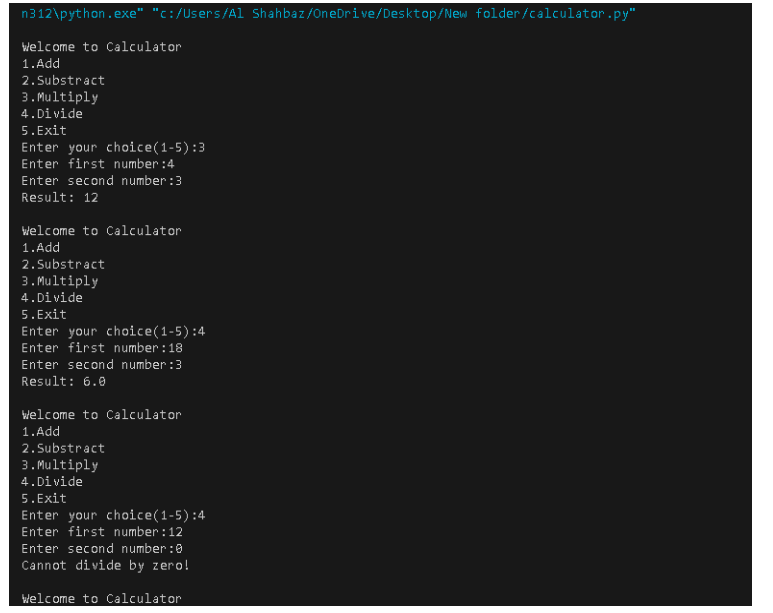

# Python Calculator Project

This is my first Python project — a simple terminal-based calculator.

## Features
- Add
- Subtract
- Multiply
- Divide (with zero check)
- Exit option

## Skills demonstrated
- Python basics
- Variables and input/output
- Conditional statements (if/elif)
- Loops (while)
- Handling divide-by-zero error
